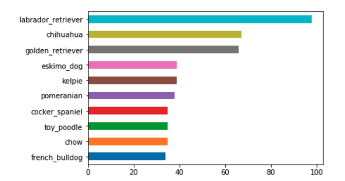
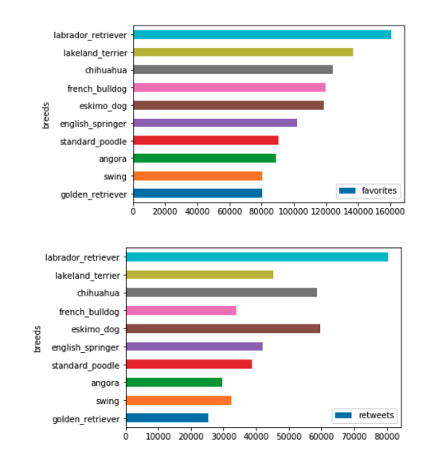
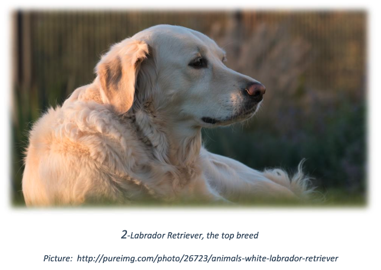

### An Analysis of the WeRateDogs :dog2:
Fourth project of Nanodegree Udacity: review of the WeRateDogsTM Twitter channel. 

I present a review of the WeRateDogsTM Twitter channel, where I investigated tweets from November 2015 and August 2017 analyzing breeds, retweets, and favorite voting and cuteness degree. The tweets are gathered, cleaned and analyzed using Python in Jupyter Notebook and some data views are made. As result, I highlight the following insights: the number of retweets for each cuteness assortment, the most common dog breeds, and the most popular breeds. 

   

### Installation 
Windows and Anaconda (run one of the following): 
conda install -c conda-forge tweepy 
conda install -c conda-forge/label/cf201901 tweepy  

### The most common dog breeds
Twittes indicate the most common dogs.
   

### The most popular dog breeds
Retwittes are features for popularity.
   

### The winner: Labrador Retriever
Labrador is the nost popular breed.
   

### Cuteness
Doggo & Puppo were found as the most cute type of dogs.

**But, what do Doggo & Puppo mean?** :thinking:

video: https://www.youtube.com/embed/ah6fmNEtXFI

### References:

-https://github.com/nanakoohashi/Wrangle-analyze-twitter-posts 
-https://github.com/DanaCody/Wrangling-Doggo-Data/blob/master/wrangle_report.pdf 
-https://github.com/MrGeislinger/UdacityDAND_Proj_WrangleAndAnalyzeData/blob/master/act_report.pdf 
-http://lindsaymoir.com/wp-content/uploads/2018/06/wrangle_act-1.html 
-https://www.geeksforgeeks.org/python-pandas-series-str-count/ 
-https://pandas.pydata.org/pandas-docs/stable/reference/api/pandas.DataFrame.drop.html 

### License
MIT License 
Copyright (c) 2010-2019 Google, Inc.

