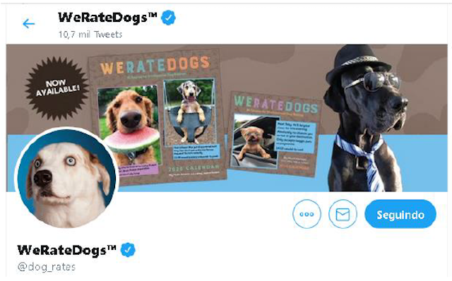

# An Analysis of the WeRateDogs
Fourth project of Nanodegree Udacity: review of the WeRateDogsTM Twitter channel.  

I present a review of the WeRateDogsTM Twitter channel, where I investigated tweets from November 2015 and August 2017 analyzing breeds, retweets, and favorite voting and cuteness degree. The tweets are gathered, cleaned and analyzed using Python in Jupyter Notebook and some data views are made. As result, I highlight the following insights: the number of retweets for each cuteness assortment, the most common dog breeds, and the most popular breeds.  

    

## Installation  
Windows and Anaconda (run one of the following):  
conda install -c conda-forge tweepy  
conda install -c conda-forge/label/cf201901 tweepy   

Karina Condeixa – karina.condeixa@gmail.com

